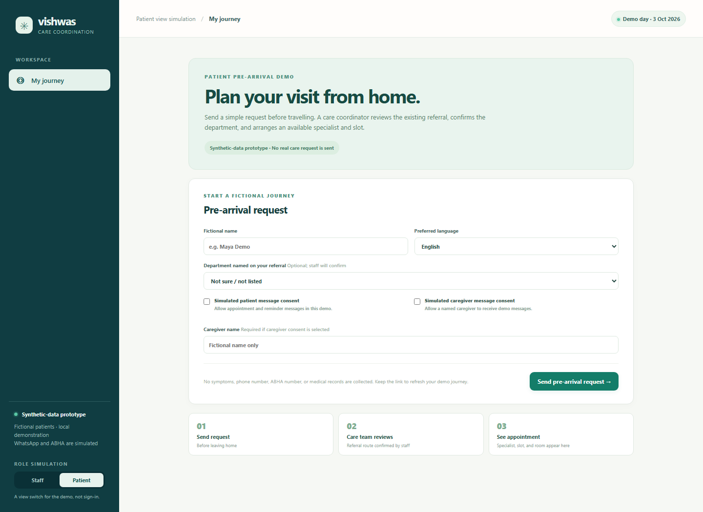

# Vishwas

**The right specialist. A prepared visit. A follow-up that stays visible.**

Vishwas starts before the patient travels to hospital. From home, the patient submits a visit request and the department named in a referral. Staff review it remotely and book a matching specialist. The patient sees the slot, clinic location and preparation checklist before arrival. The same journey then carries through check-in, reminders and a confirmed return visit.

**Applicant:** Bhavya Dhoot · **Track:** Diabetes · **Primary user:** Doctor / Care Team
**Submission category:** Clinic Operations & Patient Flow



## Run it

Use Node.js **22.13 or newer**. No dependency installation or build step is required.

```sh
git clone https://github.com/Bhavya-Dhoot/Vishwas.git
cd Vishwas
npm start
```

Open the [patient pre-arrival page](http://127.0.0.1:3000/?view=patient) and the [staff workspace](http://127.0.0.1:3000) in separate tabs. State persists in the ignored data/vishwas.sqlite file. Use **Demo controls → Reset demo** to restore the fictional seed. Node 22 may print an experimental SQLite warning.

```sh
npm test
```

## Try the journey

1. On the patient page, submit a fictional request from home. Select the department named on the referral, or leave it for staff review. Keep the resulting demo journey link.
2. In the staff tab, refresh and open that patient's request. Confirm the department from the existing referral. No specialty is inferred from symptoms.
3. Choose a matching specialist and available slot. Return to the patient tab and click **Refresh journey**: the doctor, time, room and checklist appear before any check-in.
4. Mark document readiness from the patient page. Staff see those updates in the same journey.
5. At arrival, staff record check-in and attendance evidence, then enter a clinician-set return date. The patient can refresh to see the new follow-up.
6. Advance the demo clock and run reminders. Add a travel/work/booking barrier, review its draft and record staff help.
7. Rebook and verify the return visit. Rebooking or messaging alone does not complete it.

The demo begins on 3 October 2026, with slots through 20 October. The automatic reminder check runs every minute while the server is on; **Run reminders** invokes the same logic immediately.

## What is implemented

- Persisted intake, staff-confirmed routing, language/department matching and capacity-checked bookings.
- Document-presence checklist, check-in and staff-attested attendance.
- Separate follow-up episodes, immutable original due dates, rescheduling and operational counts.
- English/Hindi reminders in a simulated WhatsApp inbox, patient/caregiver consent, logistical replies, reviewed drafts and audit history.
- Optional OpenAI administrative reply drafting, with a working clinic-template fallback.
- Responsive staff/patient demo views and optional simulated ABHA consent.

See the [patient's plan before arrival](docs/screenshots/patient-plan.png), [staff workspace](docs/screenshots/overview.png), [routing screen](docs/screenshots/routing.png) and [follow-up inbox](docs/screenshots/follow-up.png).

## Integration status

This is a working **local, synthetic-data prototype**. WhatsApp delivery, ABHA consent and hospital connections are simulated. No real messages are sent, no health records are fetched, and there is no public hosted app or live hospital pilot.

The AI adapter is implemented and tested with mocked responses. To configure it, copy .env.example to .env and set OPENAI_API_KEY and OPENAI_MODEL for a supported Responses API model. No key is required to use the prototype. **Improve draft** sends only a selected administrative category, language and approved template; it does not send patient records or free text. Staff still approve the result. Live AI calls have not been verified in this environment.

Keep the server on localhost and use fictional data. The role switch is a demo view, not authentication.

## Submission materials

- [All form answers and core idea](docs/submission.md)
- [Form values and length checks](docs/submission.json)
- [Implementation, ABHA scope and next steps](docs/build-plan.md)
- [Seven-slide deck context and 60-second pitch](docs/pitch-deck-context.md)
- [Verification record](docs/verification.md)

The project started with the concept and an existing deck. This prototype was built during submission preparation and is disclosed as existing prototype work. The deck itself was not supplied for review or upload.

## Scope and evidence

Routing follows a staff-confirmed referral. No diagnosis, medical-record interpretation, clinical risk scoring, investigation suggestions or treatment advice are implemented.

Automated tests cover the full workflow, booking/consent constraints, persistence and optional AI drafting. A desktop browser walkthrough also completed the journey through a confirmed return, and the mobile layout was checked at 390px. All dashboard figures are synthetic; no reduction in hospital waiting time or clinical outcome has been measured.
