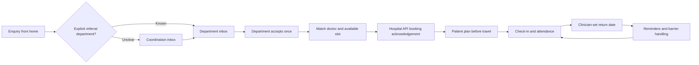
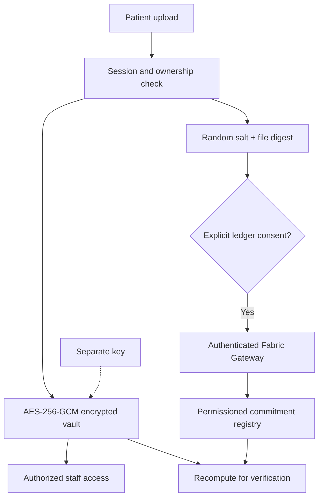

# Vishwas — architecture changes for the submission

Prepared 3 October 2026 for Bhavya Dhoot. See the verification record for completed integration checks.

## The patient journey

The enquiry starts the visit before arrival. A known referral department is routed automatically. Once the department accepts, matching and scheduling are automatic with the patient's consent. Unclear referrals, unavailable slots and booking failures remain visible exceptions. Without a connector, the demonstration uses its local directory.

## What changed

| Previous workflow | Revised workflow | Purpose |
| --- | --- | --- |
| Staff sort every enquiry | Exact referral-department rules populate department inboxes | Start coordination before arrival |
| Staff choose doctor and slot separately | One acceptance triggers deterministic assignment and scheduling | Reduce routine matching work |
| Document-presence checklist only | Encrypted uploads and preparation checklist | Give staff supporting files before the visit |
| Fixed local directory | Configurable directory and availability import | Reflect changing doctors and schedules |
| Local bookings only | Sample API reservation and acknowledgement | Demonstrate integration and failure paths |
| No ledger | Optional Fabric commitment registry | Check file integrity without placing records on-chain |

## Deterministic routing and scheduling

The survey captures the department already named on a referral, language, scheduling consent, date/time preferences and an optional preferred doctor. A valid department ID or exact directory label goes to that department. Missing or unknown departments go to coordination. Free-text symptoms, lab values and uploaded record contents never select a specialty.

After acceptance, scheduling checks department, language, preferences, availability and capacity. A compatible slot is chosen using a stable ordering. The response records the decision reason and policy version. No matching slot means a waitlist; the system does not silently change preferences. No scheduling consent means staff scheduling. This identifies an administratively compatible appointment, not the medically best doctor.

## Data security and Fabric

Only a salted 256-bit commitment reaches the ledger. Patient names, IDs, ABHA numbers, filenames, medical contents and raw file hashes stay off-chain. The salt is stored in the encrypted vault. Deleting the off-chain document leaves its opaque ledger commitment, which the consent wording must explain.

AES-256-GCM and access controls protect stored information. Fabric provides a shared integrity check for participating organizations. Matching a commitment does not establish the medical accuracy of the file, the identity of its issuer or the quality of the routing decision. Two organizations on a local development network do not establish real hospital governance.

Ledger downtime must not lose an upload: the encrypted file is saved with an honest pending or failed anchor status. A verified badge requires a successful ledger lookup and a matching recomputed commitment. Ledger anchoring is optional; the hospital workflow can run without it.

Fabric fits the proposed permissioned institutional registry. For a single hospital, encryption and controlled access may be enough. See the [official Fabric architecture](https://hyperledger-fabric.readthedocs.io/en/latest/private-data-arch.html) and [test-network documentation](https://hyperledger-fabric.readthedocs.io/en/release-2.5/test_network.html).

## Existing hospital integration

The first connector uses a documented sample REST API to import departments, doctors and slots, reserve a slot with an idempotency key and acknowledge the booking. The local appointment is confirmed only after the remote reservation succeeds. A failed local commit triggers cancellation, with an explicit reconciliation error if cancellation also fails. A process crash between systems remains a recovery concern in this prototype.

The sample exchanges opaque booking IDs rather than patient documents. Real hospitals require vendor API access, identifier mapping, authentication, scheduling rules and acceptance testing. This is a configurable adapter boundary, not universal compatibility. Production also needs individual staff accounts, patient identity verification, HTTPS, managed keys and backups, retention rules, monitoring and recovery procedures.

## PPT changes to make

1. Lead with routing before arrival; follow-up continues that same journey.
2. Replace manual staff sorting and slot selection with department inbox → accept once → assigned doctor and appointment.
3. Show survey fields capturing an existing referral, not a new medical recommendation.
4. Add directory/availability import and booking acknowledgement to the architecture.
5. Draw medical files in the encrypted off-chain vault and only commitments entering Fabric.
6. Distinguish verified local components from simulated WhatsApp/ABHA and future deployment. Check the final verification record before claiming a live ledger demonstration.
7. Propose a pilot measuring enquiry-to-booking time, staff actions per booking, wrong-desk transfers and verified return attendance. No outcome reductions have been measured yet.

## Answers to likely architecture questions

**Why retain one acceptance?** Department ownership of enquiries is the selected workflow. Once accepted, routine matching and scheduling are automatic. Staff handle exceptions.

**Why not store records on-chain?** Records need controlled access, retention and deletion. The encrypted vault supports that, while a commitment supports an integrity check without publishing the record.

**Why Fabric?** Permissioned identities and organizational policies suit a proposed group of participating institutions. It remains an optional verification layer, with governance and production operation still to establish.

**Does uploading records create clinical AI?** Document handling alone does not interpret clinical content. Inferring a specialty from that content would cross the form's stated boundary, so this algorithm does not do it.

**Can this connect to every hospital immediately?** No. The tested sample contract shows how an adapter works. Each vendor needs a compatible interface or mapping and a hospital acceptance test.
